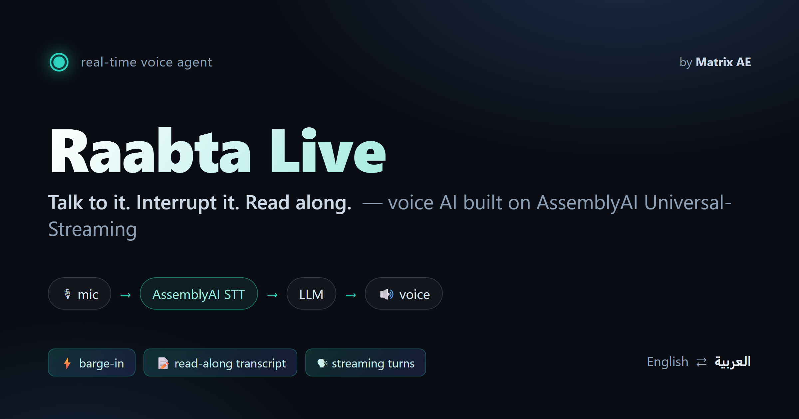

<div align="center">



# ◉ Raabta Live

### A multi-tenant voice-AI platform — built on AssemblyAI Universal-Streaming

**Sign up → build your own voice agent → drop one line of HTML on any site → watch the calls,
transcripts and analytics roll in.** Real-time, interruptible, bilingual voice agents you can talk over.

`AssemblyAI Universal-Streaming` · `TypeScript` · `Node.js` · `SQLite` · `Web Audio API` · `WebSocket`

_Submission for the lablab.ai × AssemblyAI "Build voice AI agents on AssemblyAI" hackathon — by **Matrix AE**._

</div>

---

## What it is

Most "voice agent" demos are a single bot on one page. **Raabta Live is the whole product around it** —
a small but complete SaaS:

1. **Sign up** and you instantly get a workspace with your own agent + a publishable embed key.
2. **Customize the agent** in a dashboard — persona, greeting, voice, keyterms, language.
3. **Embed it anywhere** with one line: `<script src=".../embed.js" data-agent-key="pk_live_…" async></script>`.
   A floating "Talk" button appears on your site; visitors have a real-time voice conversation.
4. **Watch it work** — every call is recorded as a speaker-attributed transcript with live analytics
   (calls, avg duration, turns, **barge-in rate**, reply latency p50/p95, language split).

The voice loop itself is built on **[AssemblyAI Universal-Streaming](https://www.assemblyai.com/docs/speech-to-text/universal-streaming)**
(the Path-2 track): the caller's audio streams to AssemblyAI over a WebSocket, and its semantic
**end-of-turn detection** decides the moment the caller has finished — which is what makes the
turn-taking (and the barge-in) feel human.

## The 60-second demo

> Open `/dashboard` → **Create a workspace** → you land on a live analytics home. Open **Embed & keys**,
> copy your snippet, click **Preview on a demo site** — a third-party page with your agent's Talk button.
> Click it, allow the mic, and **talk**. Try interrupting mid-sentence. Go back to **Calls** and read the
> transcript of the call you just made.

Every number on that dashboard came from a call your agent actually handled — nothing seeded.

## Why it's different

- **Barge-in that actually works.** Start talking over the agent and the in-flight LLM + TTS abort
  instantly and the browser flushes queued audio — the hardest thing to get right in a voice agent, and
  now a **measured metric** (barge-in rate) on every tenant's dashboard.
- **Multi-tenant by construction.** Every row is scoped to a tenant; the data layer bakes `WHERE tenant_id`
  into every query, so one customer can never see another's calls — enforced by a build-failing isolation test.
- **Embed anywhere.** A publishable `pk_live_` key (safe in a browser, like a Stripe key) drops your agent
  onto any website. It can *only* start a voice call for its agent — never touch the dashboard or another tenant.
- **Read-along transcript.** Partials stream as you speak; the agent's reply streams in sentence-by-sentence.
  The UI makes the real-time STT legible — no faked demo.
- **Bilingual brain & voice (Arabic ⇄ English).** The agent mirrors the caller's language and speaks natural
  Gulf Arabic or English (transcript flips to RTL). _(See the honest note on Arabic below.)_
- **Zero-infra.** One SQLite file, one process. `npm install && npm start` — no external database.

## Verified working (live)

The full multi-tenant pipeline is proven end-to-end against the real APIs by
[`scripts/smoke.mjs`](scripts/smoke.mjs), which resolves an embed key and streams a real 16 kHz clip
through `/ws?key=…` exactly like the browser widget does:

```
using demo embed key pk_live_…
ready (sttLive=true, ttsRate=24000)
  agent: Thanks for calling Raabta. How can I help you today?
  FINAL: Can you book me a flight from New York to Boston?
  agent: I'm sorry, but we don't handle flight bookings.
PASS — STT -> LLM -> TTS round-trip works.
```

Plus **32 hermetic unit tests** (`npm test`), including a cross-tenant isolation tripwire that fails the
build if tenant A could ever read tenant B's data.

## Architecture

```
 Owner (dashboard)                          Node backend (src/)                External APIs
 ┌────────────────────┐  session cookie   ┌─────────────────────────┐
 │ /dashboard SPA     │ ───REST/JSON────▶ │  requireOwner + ScopedDb │──┐
 │  agents · keys ·   │                   │  (every query WHERE      │  │  SQLite (better-sqlite3)
 │  calls · analytics │ ◀──────────────── │   tenant_id)             │  │  data/raabta.db
 └────────────────────┘                   └─────────────────────────┘  │  tenants·users·sessions·
                                                                        │  agents·embed_keys·calls·
 Visitor (embed widget on any site)         resolve pk_live_ on upgrade │  transcript_turns
 ┌────────────────────┐  wss /ws?key=     ┌─────────────────────────┐  │
 │ mic → AudioWorklet │ ──binary PCM16──▶ │  VoiceSession (per agent)│──┘
 │  (16 kHz)          │                   │   ├ AssemblyAI STT       │────▶ ◎ AssemblyAI Universal-Streaming
 │  read-along UI     │ ◀── JSON + PCM ── │   ├ LLM (stream)         │────▶ ◎ OpenAI / Gemini
 │  gapless playback  │   transcript+     │   ├ TTS (stream)         │────▶ ◎ ElevenLabs / Cartesia
 └────────────────────┘   agent audio     │   └ CallRecorder ────────┼──── persists calls + transcript
                                          └─────────────────────────┘
```

**Two separate planes.** The **owner plane** (dashboard) authenticates with a revocable session cookie;
the **embed plane** (voice) authenticates only with a publishable key resolved on the WebSocket upgrade —
a bad/revoked key is rejected *before* any provider socket opens. The two never cross.
Full detail in [`docs/architecture.md`](docs/architecture.md).

## Quickstart

```bash
git clone https://github.com/FahadRamxan/AssemblyAI---Voice-Agent-Hackathon---Matrix-AE.git
cd AssemblyAI---Voice-Agent-Hackathon---Matrix-AE
npm install
cp .env.example .env      # add your keys (see below)
npm start                 # -> http://localhost:8790
```

- **http://localhost:8790/dashboard** — create a workspace, build your agent, get your embed snippet.
- **http://localhost:8790/** — the live demo widget (talks to the seeded demo agent).

**Keys** (in `.env`): `ASSEMBLYAI_API_KEY` (live STT), one LLM key (`OPENAI_API_KEY` or `GEMINI_API_KEY`),
and one TTS key (`ELEVENLABS_API_KEY` or `CARTESIA_API_KEY`). Provider keys are **platform-level** — tenants
don't bring their own; that's the SaaS model. The server boots without keys and tells you what's wired.

## Multi-tenancy & security

- **Isolation by construction** — route handlers never get the raw DB handle; they get `scopedRepo(db, tenantId)`
  whose every statement carries `WHERE tenant_id`. `tenant_id` comes only from the authenticated session or the
  key-resolved row — never from client input. A leaked cross-tenant id reads as "not found".
- **Owner auth** — scrypt password hashing (timing-safe, dummy-hash on unknown email to prevent enumeration),
  revocable server-side sessions (only `sha256(token)` stored), rate-limited login/signup.
- **Embed keys** — publishable, revocable, per-key origin allowlist, per-tenant concurrency cap + session
  wall-clock cap so a lifted key can't run up provider spend. _(Origin check is a browser-only defence; the
  real backstops are revocation + caps.)_

## Data model (SQLite, 7 tables)

`tenants` · `users` · `sessions` · `agents` · `embed_keys` · `calls` · `transcript_turns` (+ a `schema_meta`
migration ledger). Every child row carries a denormalized `tenant_id`; the schema is applied idempotently on
boot with WAL + foreign keys on.

## Testing

```bash
npm run typecheck   # strict TS, clean
npm test            # 32 hermetic unit tests (no keys/network)
node scripts/smoke.mjs path/to/clip-16k-mono.raw   # live end-to-end (server running + keys set)
```

## An honest note on Arabic

AssemblyAI's **streaming** model is English-first (its multilingual streaming model adds Spanish, French,
German, Italian, Portuguese). So the **live speech-to-text** here is English. The agent's **brain and voice
are fully bilingual** — ask it to reply in Arabic and you get natural Gulf Arabic (LLM + TTS handle it, the
transcript renders RTL). Arabic *speech-to-text* is available today via AssemblyAI's batch API. We'd rather
ship the true capability than fake a live Arabic demo.

## Honest scope

- Provider keys are platform-level by design (the SaaS economics), not per-tenant BYO.
- SQLite is single-node — ideal for the hackathon + a single instance; Postgres/LiteFS is the scale path.
- On Render's free plan the disk is ephemeral (the DB resets on redeploy) — attach a persistent disk for durability.
- Billing, team seats, and email verification are modeled but not built.

## Team & disclosure

Built by **Matrix AE**, the team behind **RaabtaAI** — a production bilingual voice-agent platform for the
MENA market. RaabtaAI is a pre-existing product; **this repository is an original, self-contained build
created for this hackathon** to showcase AssemblyAI Universal-Streaming as the real-time STT foundation of a
complete SaaS. MIT licensed.

## License

[MIT](LICENSE) © 2026 Matrix AE
